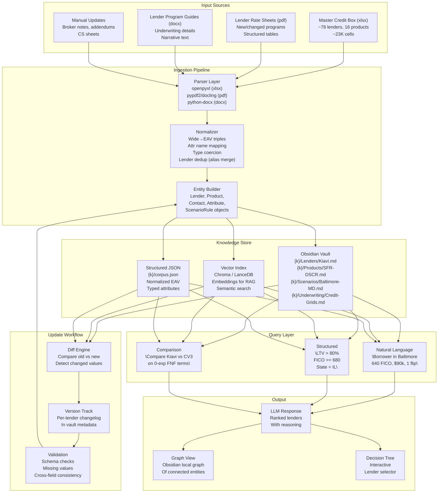
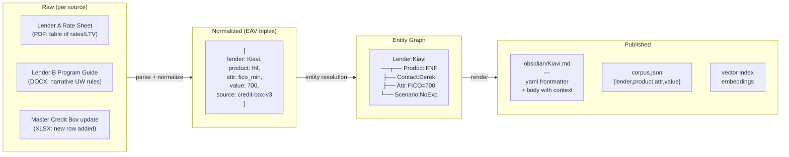
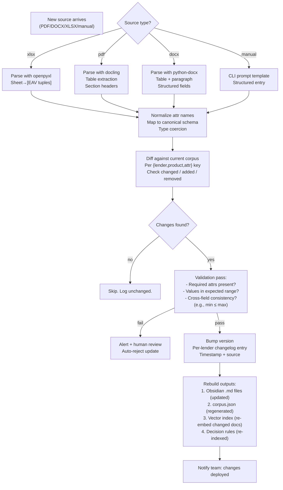

# Master Credit Box → RAG Knowledge System

## System Architecture



## Data Flow



## Update Workflow (Robust)



## Schema (Entity–Attribute–Value)

```yaml
# Canonical entity types and their attributes

entities:
  lender:
    canonical_name: string        # Kiavi
    aliases: list<string>         # [Kiavi Lending]
    contacts: list<Contact>
    dropbox_link: url
    pricer_type: enum[online, pdf, excel, contact_poc]
    portal_url: url
    login_credentials: {username, password}
    lbz_ae: string                # internal account exec
    last_updated: date

  product:
    lender_id: ref(Lender)
    product_type: enum[
      sfr_dscr, fnf, new_construction, multifamily_lt,
      sfr_bridge, sfr_blanket, multifamily_rehab,
      multi_comm_bridge, sb_commercial_lt
    ]
    status: enum[active, paused, removed]

  attribute:
    lender_id: ref(Lender)
    product_id: ref(Product)
    attr_name: string             # canonical: fico_min
    attr_value: any               # 680 or "680+" or "680-720"
    raw_text: string              # original cell value
    source_sheet: string
    source_row: int
    confidence: enum[typed, extracted_text, manual]

  contact:
    name: string
    email: string
    phone: string
    lender_id: ref(Lender)
    role: string                  # Account Executive / Processor

  scenario_rule:
    scenario_id: string           # "baltimore-md", "poor-credit-600"
    product_type: string
    condition: string             # "Borrower has property in Baltimore"
    recommendation: string         # "Send to Constructive, CV3, or Conventus"
    detail: text                  # LTV haircuts, rate adders, notes
    source_sheet: string

  decision_matrix:
    matrix_type: enum[
      credit_by_fico,             # CS-CREDIT: LTV per FICO bucket
      experience_by_tier,         # CS-EXPERIENCE: LTV per experience level
      reserves_policy,            # CS-RESERVESASSETS
      lease_occupancy             # CS-LEASEOCCUPANCY
    ]
    lender: ref(Lender)
    rows: list<MatrixRow>         # depends on type
    source_sheet: string
```

## Ingestion Skill Workflow

```yaml
skill: ingest-lender-data
trigger: "New lender doc received" or /ingest

steps:
  - step: classify_source
    input: file path
    output: source type + confidence

  - step: parse
    uses: appropriate parser (xlsx/pdf/docx/manual)
    output: list of [lender, product, attr, value] tuples

  - step: normalize
    uses: attr_name mapping table
    dedup: alias resolution against existing lenders
    output: canonical EAV triples

  - step: diff
    query: current corpus for matching keys
    output: {added: [...], changed: [...], removed: [...], unchanged: [...]}

  - step: validate
    rules:
      - required attrs not null (per product type)
      - numeric ranges sensible (min_loan ≤ max_loan)
      - no duplicate {lender, product, attr}
      - state coverage parseable
    on_fail: human review flag

  - step: update
    actions:
      - write/update Obsidian .md files
      - regenerate corpus.json
      - re-embed changed vectors
      - log to changelog

  - step: notify
    output: summary of changes deployed
```

## Robustness Considerations

| Risk | Mitigation |
|---|---|
| Attribute name drift ("FICO Min" vs "min FICO") | Mapping table + fuzzy match fallback |
| New product type not in schema | Open schema — attr stored as key-value even if unmodeled |
| Partial source (only rates, no UW rules) | Per-attribute confidence score; nulls OK with source annotation |
| Lender changes name / DBA | SSCS alias table; canonical name persists; all aliases searchable |
| Stale data persists after removal | Versioned corpus; rollback capability; tombstone markers |
| PDF table extraction errors | Human verification flag on low-confidence extractions |
| Manual entry typos | Validation regex + range checks on all numeric fields |

## Query Examples (Post-Normalization)

```python
# Hypothetical query API
corpus.query("""
  lender WITH product=fix-and-flip
  AND fico_min <= 680
  AND state_coverage CONTAINS "MD"
  AND loan_min <= 100000
  AND max_experience_required >= 1
  ORDER BY rate_floor ASC
""")
# Returns: [RCN, ROC Capital, CV3, ...]

corpus.query("""
  scenario = "heavy-rehab"
  AND product = "fix-and-flip"
  AND lender NOT IN ("Kiavi", "Groundfloor")
""")
# Returns lenders with heavy-rehab + drawn-funds interest
```
